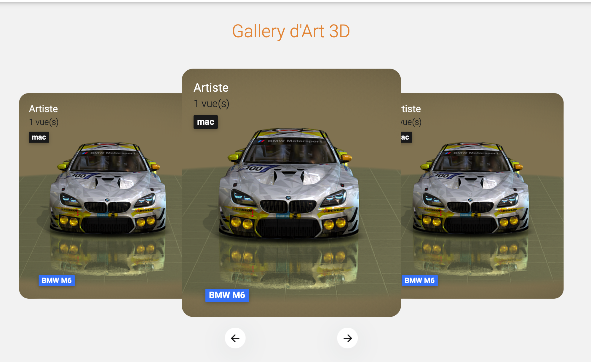
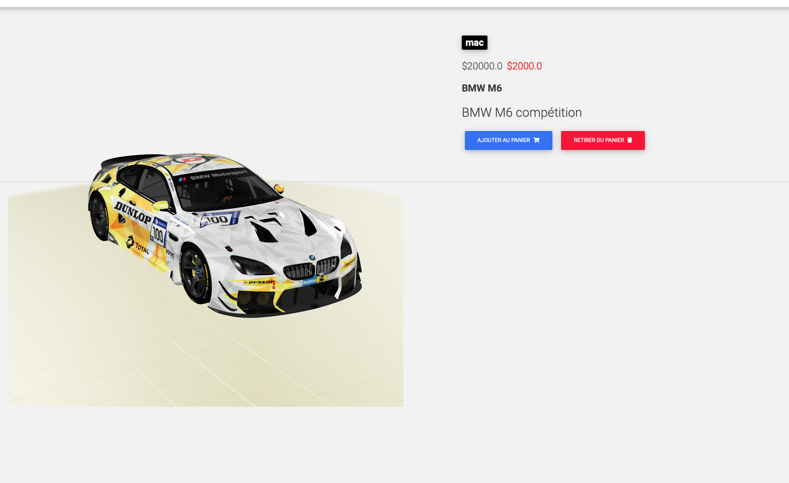

# Django Test Technique
> 3D gallery Delivery Website built with Django and MDB
# Demo: 
## Homepage

## Product page

## Installation:
**1.Clone the Repo**
```sh
git clone https://github.com/Aaron777hack/foody.git
```
**2.Setup env & Install Requirements**
```sh
virtualenv nom_env
source nom_env/bin/activate
pip install -r requirements.txt
pip install django-allauth
pip install django-countries
pip install django-crispy-forms
pip install stripe
```
**3.Set Up Django Admin**
```sh
django-admin --version
django-admin startproject project_name
```
**4.Migrate Database**
```sh
python manage.py migrate
python manage.py createsuperuser
python manage.py startapp app_name
python manage.py runserver
python manage.py collectstatic
```
**5.Start Server**
```sh
python manage.py runserver
```

**Lien en ligne**

# Contributors
Merci !